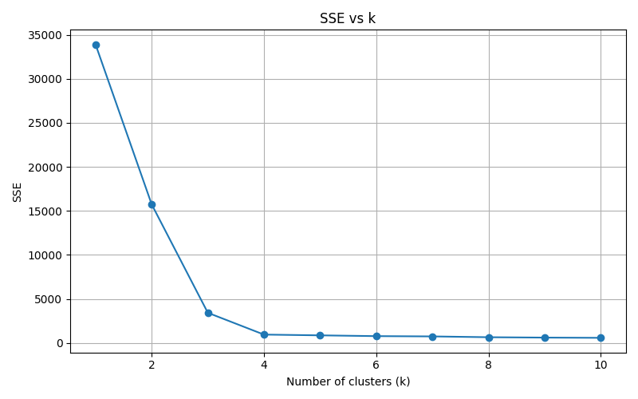
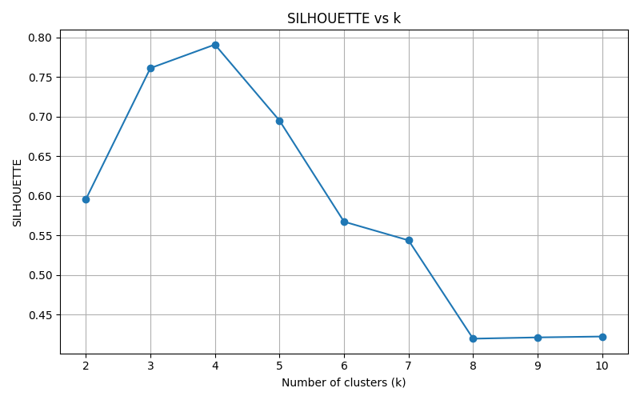
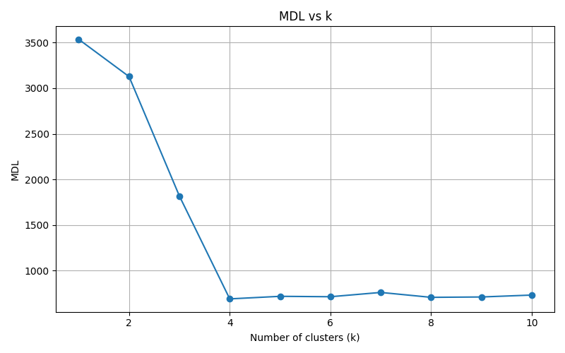
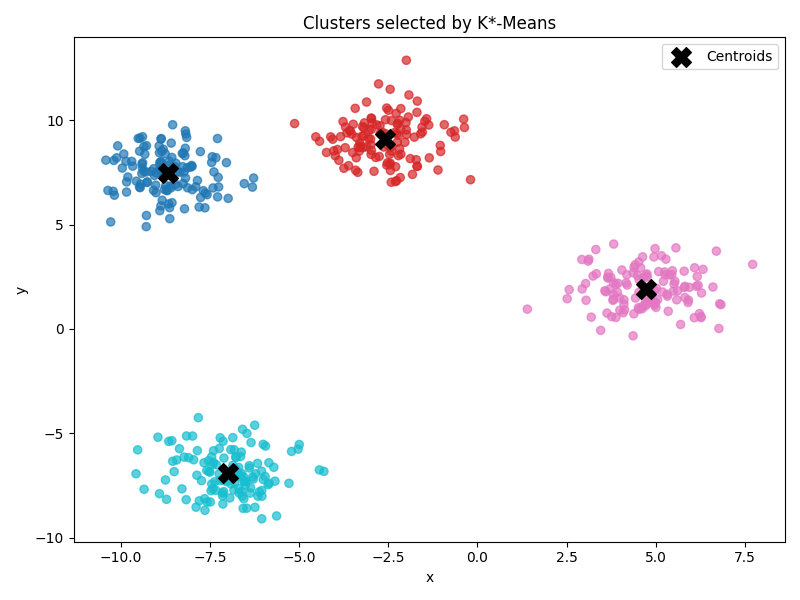

# Example analysis

This file presents an example analysis performed with the implemented K*-Means algorithm.

---

## Dataset

In this example we use a synthetic dataset generated with `make_blobs` from the `scikit-learn` library.

The dataset contains:

* 500 points
* 2 dimensions
* 4 real clusters

The data were generated using the following parameters:

```python
make_blobs(
    n_samples=500,
    centers=4,
    cluster_std=1.0,
    random_state=42
)
```

---

## Running the experiment

To run the experiment:

```bash
python experiments/run_synthetic.py
```

The script:

* generates synthetic data
* runs k-means for different k
* computes SSE, silhouette and MDL
* selects best k using MDL
* saves results and plots

---

## Results

| k  | SSE      | MDL     | Silhouette |
| -- | -------- | ------- | ---------- |
| 1  | 33903.90 | 3535.96 | -          |
| 2  | 15737.08 | 3127.45 | 0.596      |
| 3  | 3426.26  | 1818.06 | 0.761      |
| 4  | 948.89   | 690.40  | 0.791      |
| 5  | 862.09   | 718.47  | 0.695      |
| 6  | 773.77   | 713.97  | 0.567      |
| 7  | 741.64   | 761.07  | 0.544      |
| 8  | 649.33   | 707.34  | 0.419      |
| 9  | 607.03   | 711.30  | 0.421      |
| 10 | 580.82   | 732.28  | 0.422      |

Best k selected by MDL:

```text
k = 4
```

---

## SSE analysis

SSE decreases as k increases.

This is expected, but it makes SSE unsuitable for selecting k because it always prefers more clusters.



---

## Silhouette analysis

Silhouette score measures how well clusters are separated.

The maximum value is achieved at:

```text
k = 4
```



---

## MDL analysis

MDL balances accuracy and model complexity.

Formula used:

```text
MDL = n*d*log(SSE/(n*d)) + k*d*log(n) + n*log(k)
```

Minimum MDL is achieved at:

```text
k = 4
```



---

## Final clustering

The final clustering contains 4 clusters.



---

## Silhouette vs MDL

Silhouette:

* measures cluster separation
* chooses best structure visually

MDL:

* balances error and complexity
* selects optimal k automatically

In this example both methods agree:

```text
k = 4
```

This confirms correctness of the implementation.
        